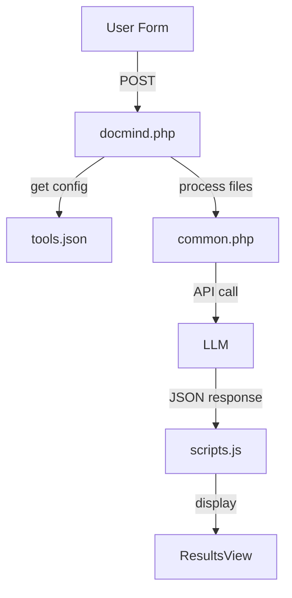

# DocMind Autonomous Agent Guide

## System Architecture
### Core Components
1. **Application Controller (docmind.php)**
   - `handleApiRequest()` - Routes API actions (get_models, suggestions, etc)
   - `handleToolAction()` - Processes form submissions and file uploads
   - `buildToolPrompt()` - Constructs dynamic prompts from tools.json configs
   - REST API endpoints for all tool operations

2. **Tool Configuration (tools.json)**
   - JSON definitions for clinical/document processing tools
   - Form field specifications with validation rules
   - Prompt templates with {placeholder} substitutions
   - Output formats (JSON/HTML/Markdown) and display templates

3. **Shared Services (common.php)**
   - File processing (images/documents/OCR)
   - Medical utilities (severity, SOAP notes, literature search)
   - API communication (callLLMApi, getAvailableModels)
   - Security/validation helpers

4. **UI Framework (scripts.js)**
   - View management (switchView, applyTheme)
   - Dynamic form rendering (createFormField)
   - Result processing (displayResults, history system)

## Key Workflows

### Tool Execution Pipeline


### Data Flow Patterns
1. **File Upload:**
   `scripts.js → docmind.php → common.php → (docx2txt/pdftotext) → LLM API`
   
2. **Clinical Analysis:**
   `SOAP note → common.php → HL7 processing → docmind.php → templated prompts`

## Modification Hotspots
### Adding New Tool (Example: Lab Report Analyzer)
1. Add to tools.json:
```json
"lab_analyzer": {
  "name": "Lab Report Analyzer",
  "category": "clinical",
  "prompt": {
    "task": "Analyze lab reports..."
  }
}
```
2. Add processing handler in docmind.php:
```php
function handleLabAnalysis($form_data) {
  // Process lab-specific data
}
```

### Modifying API Calls
1. Change API endpoint in config.php:
```php
$LLM_API_ENDPOINT = "https://new-api.example.com/v1/";
```
2. Adjust headers in common.php::callLLMApi():
```php
curl_setopt($ch, CURLOPT_HTTPHEADER, [
  'Content-Type: application/json',
  'Authorization: Bearer new_key'
]);
```

### Adding Form Field
1. Customize in tools.json:
```json
{
  "name": "priority_level",
  "type": "select",
  "options": [
    {"value": "high", "label": "🔴 High"},
    {"value": "medium", "label": "🟡 Medium"}
  ]
}
```
2. Add processing in docmind.php::handleToolAction()

## Core Integration Points
1. **Prompt Construction Flow**
   tools.json → docmind.php::buildToolPrompt() → {placeholder} replacement

2. **File Processing Chain**
   script.js upload → $_FILES → common.php::processUploadedImage() → API

3. **Result Handling Pipeline**
   JSON/HTML → scripts.js::displayResults() → Handlebars → syntax highlighting

## Agent Work Patterns
### Natural Language Requests
```natural language
"Add Portuguese language support with medical terminology"
```
Files affected: common.php (getLanguageInstruction), tools.json (form fields)

```natural language
"Increase PDF page limit from 10 to 25 pages"
```
Files affected: common.php (extractTextFromDocument)

### Configuration Updates
```natural language
"Add 'Patient ID' field to SOAP note tool form"
```
File: tools.json → "soap" tool form fields

## Aider Toolkit Tips
1. **Critical Functions Summary**
   | Function | File | Responsibility |
   |----------|------|----------------|
   | `callLLMApi()` | common.php | Executes API calls |
   | `displayResults()` | scripts.js | Renders responses |
   | `handleToolAction()` | docmind.php | Routes tool logic |

2. **Common Changes**
   - Add view: `switchView()` + new view template
   - Modify field: tools.json → createFormField()
   - New processor: common.php + docmind.php handler

3. **Debugging Targets**
   - API errors: common.php::callLLMApi()
   - Form issues: scripts.js::createFormField()
   - Prompt problems: docmind.php::buildToolPrompt()
