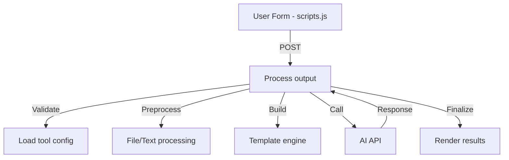

# DocMind Autonomous Agent Guide

## System Architecture
### Core Components
1. **Application Controller (docmind.php)**
   - `handleApiRequest()` - Main API router for all tools
   - `handleToolAction()` - Processes tool-specific requests
   - `buildToolPrompt()` - Merges tools.json configs with user inputs
   - `executeHelper()` - Runs web scraping/literature search helpers

2. **Tool Configuration (tools.json)**
   - Structured JSON with complete tool definitions
   - Form fields with type-specific rendering rules
   - Multi-part prompts with dynamic slot filling
   - Output templates with Handlebars.js support
   - Helper configurations (OCR, web scrapers, etc)

3. **Shared Services (common.php)**
   - File processing pipeline (`processUploadedImage`, `extractTextFromDocument`)
   - Medical analysis (`getSeverityLabel`, `searchPubMed`)
   - API communication (`callLLMApi`, `getAvailableModels`)
   - Content processing (`extractJsonFromResponse`, `markdownToHtml`)

4. **UI Framework (scripts.js)**
   - View management with smooth transitions
   - Dynamic form generation from JSON configs
   - Result display with syntax highlighting
   - History persistence with localStorage
   - Theme management with OS preference detection

## Key Workflows

### Tool Execution Pipeline


### Data Flow Patterns
1. **Document Processing:**
   ```mermaid
   flowchart LR
       UI[Form Submit] --> Tools[docmind.php]
       Tools --> Loader[tools.json]
       Tools --> Processor[common.php: extractTextFromDocument]
       Processor --> API[callLLMApi]
       API --> Output[ProcessToolResponse]
   ```
   
2. **Web Scraping:**
   ```mermaid
   flowchart LR
       URL[URL Input] --> Helper[common.php: scrapeUrl]
       Helper --> Content[Clean HTML]
       Content --> Prompt[Build prompt with tools.json]
       Prompt --> LLM[Analysis]
   ```

## Modification Hotspots
### Adding New Tool (Example: Lab Report Analyzer)
1. Add to tools.json:
```json
"lab_analyzer": {
  "name": "Lab Report Analyzer",
  "category": "clinical",
  "prompt": {
    "task": "Analyze lab reports..."
  }
}
```
2. Add processing handler in docmind.php:
```php
function handleLabAnalysis($form_data) {
  // Process lab-specific data
}
```

### Modifying API Calls
1. Change API endpoint in config.php:
```php
$LLM_API_ENDPOINT = "https://new-api.example.com/v1/";
```
2. Adjust headers in common.php::callLLMApi():
```php
curl_setopt($ch, CURLOPT_HTTPHEADER, [
  'Content-Type: application/json',
  'Authorization: Bearer new_key'
]);
```

### Adding Form Field
1. Customize in tools.json:
```json
{
  "name": "priority_level",
  "type": "select",
  "options": [
    {"value": "high", "label": "🔴 High"},
    {"value": "medium", "label": "🟡 Medium"}
  ]
}
```
2. Add processing in docmind.php::handleToolAction()

## Core Integration Points
1. **Prompt Construction Flow**
   ```mermaid
   flowchart LR
       tools.json --> Slot1[Field Definitions]
       UserForm --> Slot2[User Inputs]
       common.php --> Slot3[Language/Personality]
       docmind.php --> Merge[buildToolPrompt]
       Merge --> FullPrompt[Final Prompt]
   ```

2. **Form Rendering Process**
   ```mermaid
   flowchart LR
       tools.json --> scripts.js
       scripts.js --> createFormField
       createFormField --> DOM[Live Form]
       DOM --> HandleSubmit[API Call]
   ```

3. **Medical Processing**
   ```mermaid
   flowchart LR
       Input[Medical Text] --> common.php
       common.php --> searchPubMed
       searchPubMed --> Analysis[Results Processing]
       Analysis --> Output[Structured Data]
   ```

## Agent Work Patterns
### Natural Language Requests
```natural language
"Add Portuguese language support with medical terminology"
```
Files affected: common.php (getLanguageInstruction), tools.json (form fields)

```natural language
"Increase PDF page limit from 10 to 25 pages"
```
Files affected: common.php (extractTextFromDocument)

### Configuration Updates
```natural language
"Add 'Patient ID' field to SOAP note tool form"
```
File: tools.json → "soap" tool form fields

## Aider Toolkit Tips
1. **Critical Functions Summary**
   | Function | File | Responsibility |
   |----------|------|----------------|
   | `callLLMApi()` | common.php | Executes API calls |
   | `displayResults()` | scripts.js | Renders responses |
   | `handleToolAction()` | docmind.php | Routes tool logic |

2. **Common Changes**
   - Add view: `switchView()` + new view template
   - Modify field: tools.json → createFormField()
   - New processor: common.php + docmind.php handler

3. **Debugging Targets**
   - API errors: common.php::callLLMApi()
   - Form issues: scripts.js::createFormField()
   - Prompt problems: docmind.php::buildToolPrompt()
